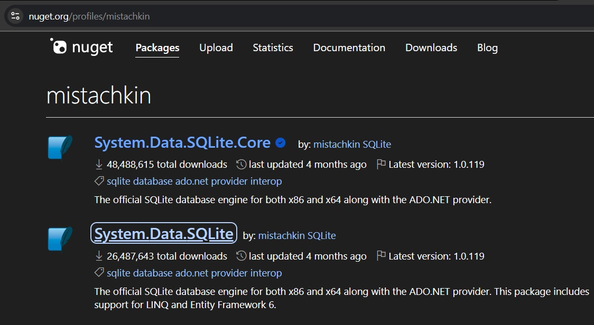

# GUI app for SQLite database Operations using C# (CSharp) and WinForms

- In this repo,you can find a C# winforms application that can connect with an SQLite Database and display the contents of the SQLite db on the Form using DataGridView Control.
- Created using Visual Studio 2022 Community
- Supports .NET Core /.NET7 /.NET8 and above.

## Youtube Video Tutorial

- [YT Video Tutorial on Building a C# Winforms application to display SQLite Tables on .NET](https://www.youtube.com/watch?v=LUslHhvLGWA)

## Online Web Tutorial

- [Integrating SQLite Database with WinForms GUI app using C# ](https://www.xanthium.in/building-csharp-sqlite-gui-crud-applications-using-winforms-api-tutorial)
- [Introduction to Connecting SQLite Database using C# for Performing CRUD operations](https://www.xanthium.in/cross-platform-create-connect-update-sqlite3-database-using-csharp-dotnet-platform)
- [How to create a stand alone windows executable file using Visual Studio Publish Command](https://www.xanthium.in/create-stand-alone-windows-executable-msi-setup-files-using-visual-studio-click-once)

## Repo Contents

 - **_1_SQLite-Database-Viewer-VS2022-Project**  -> Visual Studio 2022 **WinForms Project** along with C# Source Codes 
 - **_2_CommandLine-SQLiteDataAdapter-Tutorial** -> SQLiteDataAdapter Class tutorial (command line program)
 - **_3_Sample_SQLite_Database** -> Sample SQLite Database to use with your Project
 

## Dependencies

- Requires either [System.Data.SQLite.Core](https://www.nuget.org/packages/System.Data.SQLite.Core)

- or [System.Data.SQLite](https://www.nuget.org/packages/System.Data.SQLite)

- 

## Screenshots

- 
- 

 
